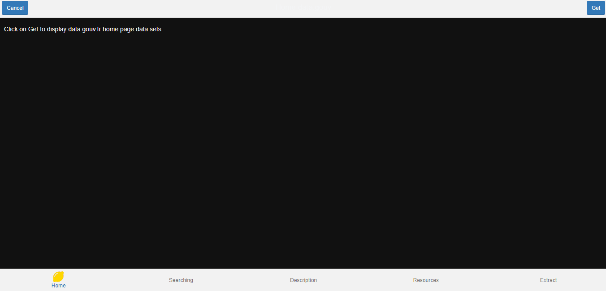

<!-- README.md is generated from README.Rmd. Please edit that file -->

# BARIS <a></a>

<!-- badges: start -->

[](https://cran.r-project.org/package=BARIS)
[](https://cran.r-project.org/package=BARIS)
[](https://cran.r-project.org/package=BARIS)
[](https://cran.r-project.org/package=BARIS)
[](https://cran.r-project.org/package=BARIS)
[](https://choosealicense.com/licenses/mit/)
[](https://github.com/feddelegrand7/BARIS)
[](https://github.com/feddelegrand7/BARIS/actions)
<!-- badges: end -->

With **BARIS** you can interact with the [French Official Open Data
Portal](https://www.data.gouv.fr/fr/) API directly from R. The package
offers several capabilities, from listing the available data sets to
extracting the needed resources. Nevertheless, there are many features
offered by the API (e.g. uploading a data set, removing a resource …
among others) that are not covered within the **BARIS** package which
instead focus on the data extraction aspect of the API. The good news is
that the user doesn’t need an API key or any credential to run the
available functions provided by **BARIS**. Finally, in order to fully
apprehend the package, a distinction has to be made. The data.gouv API
provides several **data sets which contain one or many data frames.**
The unique identifier (ID) of a data set has this form :
**53699934a3a729239d2051a1** while the ID of an individual data frame or
resource has this form: **59ea7bba-f38a-4d75-b85f-2d1955050e53**.

## Installation

- The package has been archived from CRAN. I'm in 
the process of writing a new lightweight wrapper with very few
dependencies. Indeed, BARIS provided functions to read the data directly into 
R however I think, the user should have the flexibility to decide how the data 
can be read. 

You can install the development version from
[GitHub](https://github.com/) with:

``` r
devtools::install_github("feddelegrand7/BARIS")
```

## BARIS\_home()

Using the function `BARIS_home()` you can list the displayed datasets
within the [home page of the data.gouv
website](https://www.data.gouv.fr/fr/). The function doesn’t take any
argument. It will return a data frame with many useful information about
the data set.

``` r
library(BARIS)

BARIS_home()
#> # A tibble: 9 x 13
#>   id      title      organization     page      views frequency temporal_cov_st~
#>   <chr>   <chr>      <chr>            <chr>     <chr> <chr>     <chr>           
#> 1 6246ac~ Temps de ~ https://static.~ https://~ 47    irregular 2022-03-07      
#> 2 623dd1~ Déclarati~ https://static.~ https://~ 30    unknown   <NA>            
#> 3 541014~ Prix des ~ https://static.~ https://~ 16053 unknown   <NA>            
#> 4 61f3ba~ Transitio~ https://static.~ https://~ 11    punctual  <NA>            
#> 5 620bc1~ Liste des~ https://static.~ https://~ 1     punctual  2023-12-31      
#> 6 6151bd~ Feuilles ~ https://static.~ https://~ 1481  annual    <NA>            
#> 7 5ff5e6~ Baromètre~ https://static.~ https://~ 3445  punctual  <NA>            
#> 8 60190d~ Synthèse ~ https://static.~ https://~ 42012 daily     <NA>            
#> 9 61a73d~ Index Ega~ https://static.~ https://~ 132   daily     <NA>            
#> # ... with 6 more variables: temporal_cov_end <chr>, created_at <chr>,
#> #   last_modified <chr>, last_update <chr>, archived <chr>, deleted <chr>
```

The data is quite condensed so you should use the `View()` or
`DT::datatable()` functions.

## BARIS\_search()

The `BARIS_search()` function allows you to search for a specific data
set. Suppose we’re curious about the city of Marseille.

``` r
Marseille_data <- BARIS_search(query = "Marseille", page_number = 1, page_size = 20)

Marseille_data[, c("id", "title")]
#> # A tibble: 20 x 2
#>    id                       title                            
#>    <chr>                    <chr>                            
#>  1 5cebfa839ce2e76116c3af0d Marseille - Élus                 
#>  2 5cebfa8506e3e77ffdb31ef8 Marseille - Cimetières           
#>  3 5cebfa869ce2e76116c3af11 Marseille - Délibérations        
#>  4 5cebfa869ce2e764aac3af2b Marseille - Subventions          
#>  5 5cebfa8706e3e77c78b31f0a Marseille - Crèches              
#>  6 5f654cd6e39b90e17b8021e3 Marseille - Photographies        
#>  7 604ff6a2b0a782adba71fa22 Marseille - Biodiversité         
#>  8 604ff6ddbc5a324a0c7ce5a7 Marseille - Eclairage            
#>  9 53698f14a3a729239d203643 Arrondissements de Marseille     
#> 10 5878ee29a3a7291485cac7b2 Arrondissements de Marseille     
#> 11 5878ee75a3a7291484cac81f Quartiers de Marseille           
#> 12 5cebfa8206e3e77ffdb31ef4 Marseille - Élections municipales
#> 13 5cebfa829ce2e76116c3af0c Marseille - Élections européennes
#> 14 5cebfa8306e3e77c78b31f05 Marseille - Écoles élémentaires  
#> 15 5cebfa8306e3e77ffdb31ef5 Marseille - Monuments historiques
#> 16 5cebfa8306e3e77ffdb31ef6 Marseille - Compte administratif 
#> 17 5cebfa839ce2e76116c3af0e Marseille - Wifi public          
#> 18 5cebfa839ce2e764aac3af27 Marseille - Marchés forains      
#> 19 5cebfa8406e3e77ffdb31ef7 Marseille - Équipements sportifs 
#> 20 5cebfa849ce2e764aac3af28 Marseille - Écoles maternelles
```

Suppose we’re interested in the dataset entitled **Marseille - Monuments
historiques** with its corresponding ID: **5cebfa8306e3e77ffdb31ef5**
and we want to know more about this data. In this case, the
`BARIS_explain()` function can be useful.

## BARIS\_explain()

`BARIS_explain()` returns a description of a dataset. It has one
argument which is the ID of the dataset of interest.

``` r
BARIS_explain("5cebfa8306e3e77ffdb31ef5")
#> [1] "Monuments historiques situés sur le territoire de Marseille, avec adresse, numéro de base Mérimée (base de données du Ministère de la Culture recensant les monuments historiques de toute la France) et points de géolocalisation"
```

The description is in French but even non-French speakers can use this
function in conjunction with a translation tool, for the example the
[googleLanguageR
package](https://CRAN.R-project.org/package=googleLanguageR).

## BARIS\_resources()

As mentioned previously, each data set contains one or several data
frames or as the API call them **resources**. The `BARIS_resources()`
function allows you to list all the available resources within a
determined data set.

``` r
BARIS_resources("5cebfa8306e3e77ffdb31ef5") # The "Marseille - Monuments historiques" ID
#> # A tibble: 2 x 6
#>   id         title       format published   url             description         
#>   <chr>      <chr>       <chr>  <chr>       <chr>           <chr>               
#> 1 59ea7bba-~ MARSEILLE_~ csv    2019-05-27~ https://trouve~ Monuments historiqu~
#> 2 6328f8b3-~ Plan des M~ pdf    2019-05-27~ https://trouve~ Edition Janvier 2013
```

Many useful information related to the resource are provided: The id,
the title, the format, the date of publication, the url of the resource,
and a description.

## BARIS\_extract()

The `BARIS_extract()` function allows you to extract the needed resource
into your R session. You have to specify the id of the resource and its
format. Currently, “only” theses formats are supported: json, csv, xls,
xlsx, xml, geojson and shp, nevertheless you can always rely on the url
of the resource to download whatever you need.

As an example, let us extract the above listed csv file:
*MARSEILLE\_MONUMENTS\_HISTORIQUES\_2018.csv*:

``` r
BARIS_extract(resourceId = "59ea7bba-f38a-4d75-b85f-2d1955050e53", format = "csv")
#> # A tibble: 80 x 10
#>    n_base_merimee date_de_protection_~ denomination        adresse   code_postal
#>    <chr>          <chr>                <chr>               <chr>           <int>
#>  1 PA00081336     Classement : liste ~ Ancienne église de~ "/"             13002
#>  2 PA00081340     Classement: 13/09/1~ Eglise Saint-Laure~ "Esplana~       13002
#>  3 PA00081331     Classement: 29/01/1~ Chapelle et Hospic~ "2, Rue ~       13002
#>  4 PA00081344     Classement: 16/06/1~ Fort Saint-Jean     ""              13002
#>  5 PA00081325     Inscription : 23/11~ Les deux bâtiments~ "Quai du~       13002
#>  6 PA00081334     Inscription : 07/07~ Clocher des Accoul~ "Montée ~       13002
#>  7 PA00081348     Classement: 12/01/1~ Hôtel Daviel (anci~ "Place D~       13002
#>  8 PA00081363     Classement: 02/05/1~ Maison dite de l’É~ "27, Gra~       13002
#>  9 PA00081349     Inscription : 14/10~ Hôtel-Dieu- Façade~ "6, Plac~       13002
#> 10 PA00081354     Classement: 30/04/1~ Hôtel de Ville      "Quai du~       13002
#> # ... with 70 more rows, and 5 more variables: proprietaire_du_monument <chr>,
#> #   epoque_de_construction <chr>, date_de_construction <chr>, longitude <dbl>,
#> #   latitude <dbl>
```

# BARIS Addin

BARIS comes with an integrated Addin that generates a Shiny widget
allowing the user to interact with the package in an interactive manner.
You can trigger the addin from the `Addins` menu in `RStudio` or you can
run:

``` r
BARIS:::BARIS_ui()
```



# Citation

If you use the BARIS package for your work, research or teaching, I’d
appreciate if you could cite it as follows:

Mohamed El Fodil Ihaddaden (2020). BARIS: Access and Import Data from
the French Open Data Portal. R package version 1.1.1.
<https://CRAN.R-project.org/package=BARIS>

A BibTeX entry for LaTeX users is

@Manual{, title = {BARIS: Access and Import Data from the French Open
Data Portal}, author = {Mohamed El Fodil Ihaddaden}, year = {2020}, note
= {R package version 1.1.1}, url =
{<https://CRAN.R-project.org/package=BARIS>}, }

## Code of Conduct

Please note that the BARIS project is released with a [Contributor Code
of
Conduct](https://contributor-covenant.org/version/2/0/CODE_OF_CONDUCT.html).
By contributing to this project, you agree to abide by its terms.
Finally, I appreciate any feedback, feel free to reach out at
[moh\_fodil](https://twitter.com/moh_fodil) or open an issue on
[Github](https://github.com/feddelegrand7/BARIS/issues).
